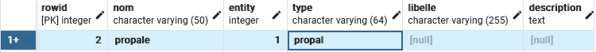
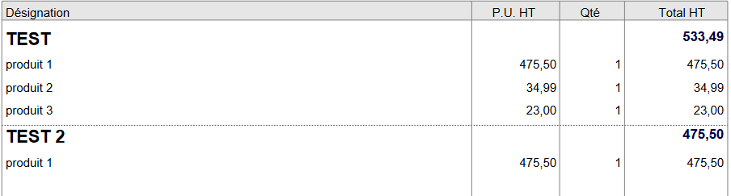

# php_modules_dolibarr
Modules php afin de générer des devis, factures, expéditions... en PDF par le biais de Dolibarr.
Ces modèles permettent l'implémentation de titres qui font un sous total de l'ensemble des produits ou services de leur sous partie.
Le cadre pour la signature est agrandie et possède de nombreuses autres améliorations esthétiques.

git clone https://github.com/Enzo1408/php_modules_dolibarr.git

## Propale :

- Copier le fichier propale/pdf_propale.modules.php 
- Coller le fichier dans le répertoire de votre Dolibarr : htdocs/core/modules/propale/doc/

Afin que votre modèle sois visible dans votre Dolibarr vous devrez modifier votre base de données (exemple : à l'aide d'une plateforme de gestion de base de donnée comme pgadmin4 ou bien directement en console pour les plus expérimentés).
Vous devrez modifier le fichier llx_document_model et ajouter une nouvelle ligne pour votre nouveau modèle qui se nommera 'propale'.

## Facture :

- Copier le fichier invoice/pdf_invoice.modules.php 
- Coller le fichier dans le répertoire de votre Dolibarr : htdocs/core/modules/propale/doc/

Afin que votre modèle sois visible dans votre Dolibarr vous devrez modifier votre base de données (exemple : à l'aide d'une plateforme de gestion de base de donnée comme pgadmin4 ou bien directement en console pour les plus expérimentés).
Vous devrez modifier le fichier llx_document_model et ajouter une nouvelle ligne pour votre nouveau modèle qui se nommera 'invoice'.

## Expédition :

- Copier le fichier shipment/pdf_shipment.modules.php 
- Coller le fichier dans le répertoire de votre Dolibarr : htdocs/core/modules/propale/doc/

Afin que votre modèle sois visible dans votre Dolibarr vous devrez modifier votre base de données (exemple : à l'aide d'une plateforme de gestion de base de donnée comme pgadmin4 ou bien directement en console pour les plus expérimentés).
Vous devrez modifier le fichier llx_document_model et ajouter une nouvelle ligne pour votre nouveau modèle qui se nommera 'shipment'.

## Utilisation

Tout d'abord vous devrez activer le module Éditeur WYSIWYG dans votre Dolibarr (Accueil -> Configuration -> Modules/Applications).
Pour effectuer un champ TITRE vous devrez mettre dans 'ligne libre de type': sois produit sois service.
Mettez votre description en format TITRE à l'aide de l'éditeur et mettez la quantité à 0.

Générez votre pdf et vous aurez un Titre.

Vous pourrez mettre autant de produit/service que vous le souhaitez sous le Titre, le sous total du Titre se mettra à jour systématiquement.

## Modification du pied de page

Si les informations du pied de page ne vous conviennent pas et que vous voulez mettre des informations qui vous sont propre, il vous suffit d'ouvrir le fichier php et d'aller dans la fonction 'signature_area' (ligne 1869). 
Vous verrez dans le code deux champs de texte que vous pourrez modifier comme bon vous semble.

Pour toute information complémentaire n'hésitez pas à me contacter par mail : enzo.cornaggia@icloud.com
